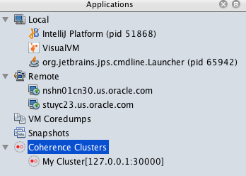

# Access management over REST using JVisualVM plugin

The Coherence JVisualVM Plugin in Coherence version 12.2.1.4.0 and above has the ability to connect 
to a Coherence cluster using REST. 

*Note*: This feature is only available in Coherence 12.2.1.4.0 and later.

[Return to Management over REST samples](../)  [Return to Management samples](../../) / [Return to samples](../../../README.md#list-of-samples)

## Prerequisites

1. Install Coherence Cluster

   Follow the instructions [here](../standard/README.md#installation-steps) to install a Coherence cluster and port-forward the Management
   over REST port.

2. Install the Coherence JVisualVM plugin

   Follow the instructions [here](https://docs.oracle.com/middleware/12213/coherence/manage/using-jmx-manage-oracle-coherence.htm)
   to install the JVisualVM plugin.

## Installation Steps

1. Startup JVisualVM

   ```bash
   $ visualvm
   ```
   
1. Create the Connection

   If the Coherence JVisualvm plugin is correctly installed, then you should see a `Coherence Clusters` item under the
   `Applications` tab.
   
   Right-click on this and select `Add Coherence Cluster`.
   
   Enter a name describing the cluster, and then enter the following for Management REST URL:
   
   `http://127.0.0.1:30000/management/coherence/cluster`
   
   You should see the following:
   
   
   
1. Connect to the cluster

   Double-click on the new cluster you created and the `Coherence` tab will be visible from within the JVisualVM.
   
## Uninstalling the Charts

Carry out the following commands to delete the chart installed in this sample.

```bash
$ helm delete storage --purge
```

Before starting another sample, ensure that all the pods are gone from previous samples.

If you wish to remove the `coherence-operator`, then include it in the `helm delete` command above.    
